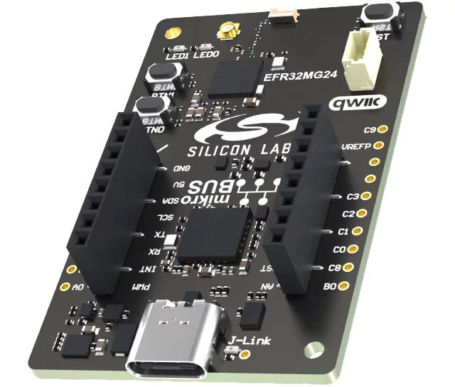
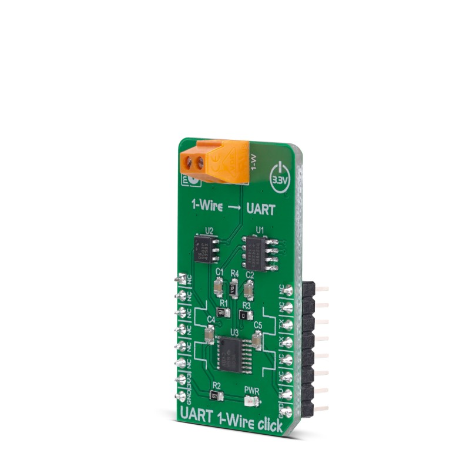
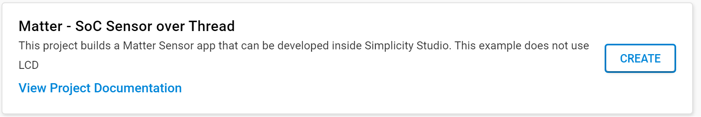
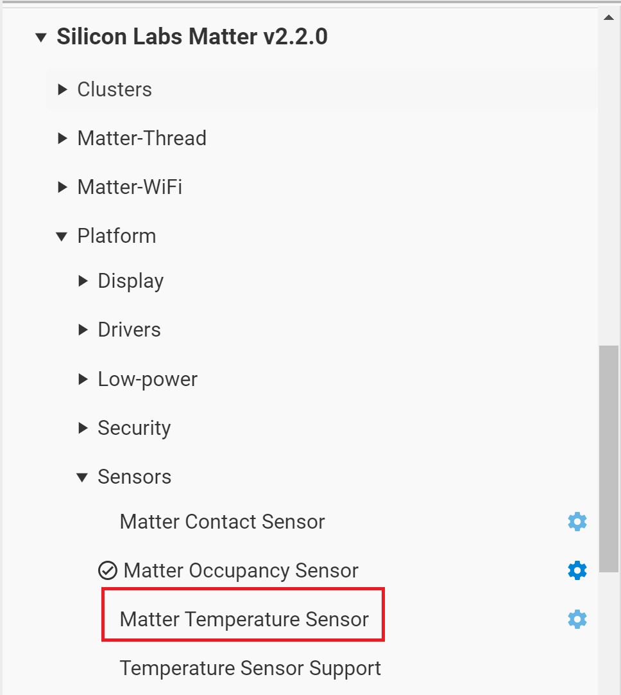
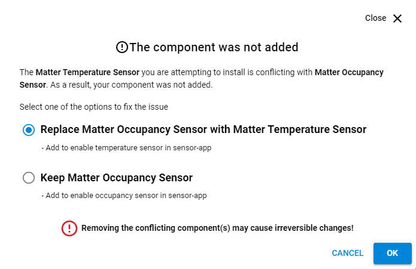
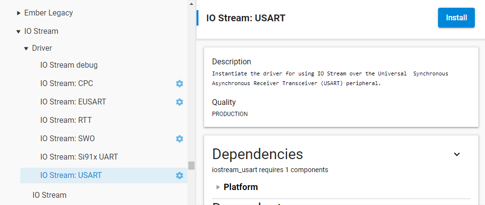
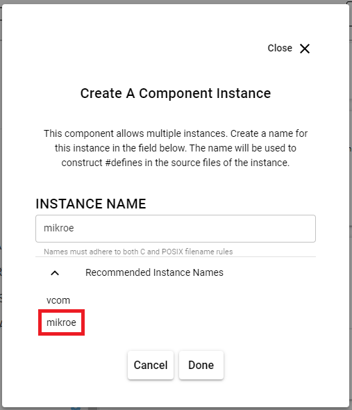

# Building a Matter Accessory Device based on Silicon Labs EFR32xG24 Dev Kit Board (BRD2601B)
### Author: [Olav Tollefsen](https://www.linkedin.com/in/olavtollefsen/)

## Introduction

This article shows how to modify the "Matter - SoC Sensor over Thread" example project with support for a 1-Wire Dallas Semiconductor DS18B20 temperature sensor conneected to a Mikro Elektronika UART 1-WIRE CLICK attached to the Silicon Labs EFR32xG24 Explorer Kit Board (EK2703A).

This article is based on Silicon Labs Gecko SDK version 4.3.2 with Silicon Labs Matter 2.1.1 extensions.

### What you will need

- A PC running Windows as the development workstation.
- Install Simplicity Studio V5 from Silicon Labs.
- Silicon Labs EFR32xG24 Explorer Kit Board (EK2703A).
- Mikro Elektronika UART 1-WIRE CLICK
- Dallas Semiconductor DS18B20 temperature sensor

This article assumes that you have already installed Simplicity Studio V5 and the Gecko SDK 4.3.2

## Create the initial project based on the "Matter - SoC Sensor over Thread" example project

Start by creating a new project in Simplicity Studio V5 by selecting the "Matter - SoC Sensor over Thread" example project and click "Create":

This is a good starting point as it already implements a fully functional Matter over Thread device. Unfortunately it only supports some simulated sensors and not the actual sensors found on the develkopment kit board.

## Change the default sensor type

When you create the sensor project it defaults to Occupancy Sensor. To switch between
the sensors, uninstall the 'Matter Occupancy Sensor'/current sensor component and install the
respective sensor component to enable it. One sensor component should be enabled for the app to build.

Open the .slcp file in your project and select "SOFTWARE COMPONENTS".

Navigate to "Silicon Labs Matter v2.1.1->Platform->Sensors:

Select the "Matter Temperature Sensor" component and click "Install".

When asked click on "Replace Matter Occupancy Sensor with Matter Temperature Sensor":

Select "Temperature Sensor Support" and click "Install".

## Add support for UART to the project

Open the .slcp file in your project and select "SOFTWARE COMPONENTS".

Locate "Services->IO Stream->Driver->IO Stream: USART", select it and click "Install"

In the Create a Component Instance dialog, select the instance name "mikroe" from the "Recommended Instance Names" list and click Done.

Click on the created "mikroe" instance and select 

