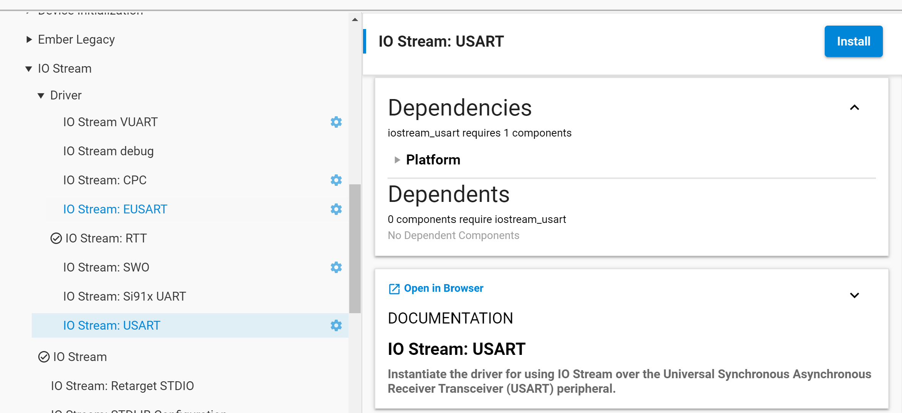
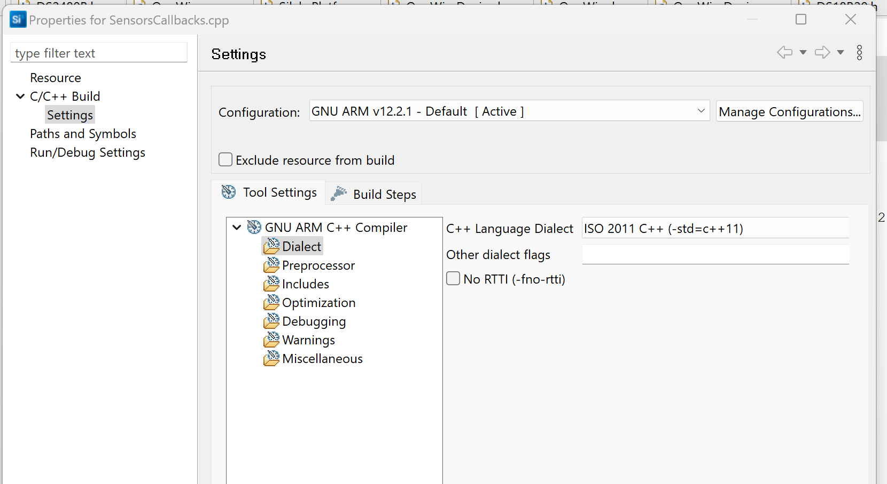

# Building a Matter Accessory Device based on Silicon Labs EFR32xG24 Explorer Kit Board (EK2703A) with a Mikro Elektronika UART 1-WIRE CLICK and a Dallas Semiconductor DS18B20 temperature sensor.
### Author: [Olav Tollefsen](https://www.linkedin.com/in/olavtollefsen/)

## Introduction

This article shows how to modify the "Matter - SoC Sensor over Thread" example project with support for a 1-Wire Dallas Semiconductor DS18B20 temperature sensor conneected to a Mikro Elektronika UART 1-WIRE CLICK attached to the Silicon Labs EFR32xG24 Explorer Kit Board (EK2703A).

This article is based on Silicon Labs Gecko SDK version 4.3.2 with Silicon Labs Matter 2.2.0.

### What you will need

- A PC running Windows as the development workstation.
- Install Simplicity Studio V5 from Silicon Labs.
- Silicon Labs EFR32xG24 Explorer Kit Board (EK2703A).
- Mikro Elektronika UART 1-WIRE CLICK
- Dallas Semiconductor DS18B20 temperature sensor

This article assumes that you have already installed Simplicity Studio V5 and the Gecko SDK 4.4.0

## Mount the Mikro Elektronika UART 1-WIRE CLICK

When mounting the Mikro Elektronika UART 1-WIRE CLICK on the Silicon Labs EFR32xG24 Explorer Kit Board make sure it's oriented correctly according to this illustration:

## Create the initial project based on the "Matter - SoC Sensor over Thread" example project

Start by creating a new project in Simplicity Studio V5 by selecting the "Matter - SoC Sensor over Thread" example project and click "Create":

This is a good starting point as it already implements a fully functional Matter over Thread device.

## Support for newer C++ versions

By default, the project will support "-std=gnu++17". In the default project there are two settings related to the C++ language version. The first setting is the "C++ Language Dialect" setting under "Dialect" (under "GNU ARM C++ Compiler" settings). The other setting is under "Other flags" (under "Miscellanous"). There you will find a flag "-std=gnu++17". It looks like this flag setting takes precedence over the  "C++ Language Dialect" setting. I think it's best to remove the line with the flag under "Other flags" and rather change the "C++ Language Dialect" setting.

## Change the default sensor type

When you create the sensor project it defaults to Occupancy Sensor. To switch between
the sensors, uninstall the 'Matter Occupancy Sensor'/current sensor component and install the
respective sensor component to enable it. One sensor component should be enabled for the app to build.

Open the .slcp file in your project and select "SOFTWARE COMPONENTS".

Navigate to "Silicon Labs Matter v2.2.0->Platform->Sensors:

Select the "Matter Temperature Sensor" component and click "Install".

When asked click on "Replace Matter Occupancy Sensor with Matter Temperature Sensor":

Select "Temperature Sensor Support" and click "Install".

## Add USUART support for the Mikro Elektronika UART 1-WIRE CLICK

Open the .slcp file in your project and select "SOFTWARE COMPONENTS".

Locate "Services->IO Stream->Driver->IO Stream: USART", select it and click "Install"

Select the name "mikroe" and click Done.

Select the "mikroe" instance and click "Configure"

Change the Baud Rate to 9600 and the CTS and RTS to None.

Note! Keep an eye on the "Receive buffer size" setting. If you are expecting longer messages to arrive, you need to increase this setting. Otherwise, you may lose input bytes.

## Enable the "printf float" option

If you want to be able to print float values, you need to enable the "printf float" option as shown below:

## Turn off C++ "No RTTI" option

In order to use some C++ language features (like dynamic_cast) you may need to turn off the "No RTTI" option.

## Viewing debug logs

The logging destination is controled by components found under "Silicon Labs Matter v2.5.1->Platform->Utils":

### Matter Core Components Settings

You can check the settings for the debug outputs under "Matter Core Components" under "Software Components" in your project.

### View UART logging in the Simplicity Studio Debugger

Find your connected device in the Debug Adapters view, select it, right click and select "Launch Console...":

Select the "Serial 1" tab, click in the input field at the botton to connect to the UART. You should now see log messages in that window.

### View UART logging using the J-Link RTT Viewer

You can view the debug log statements using "J-Link RTT Viewer". You can download J-Link RTT Viewer, which is included in the "J-Link Software and Documentation pack" here:

https://www.segger.com/downloads/jlink/#J-LinkSoftwareAndDocumentationPack

### Running J-Link RTT Viewer

Make sure your device is  connected to an USB port and the software on it is running. Start the J-Link RTT Viewer and select "Connect" from the File menu.

### Select Target Device

Select your target device in the connect dialog:

If you have multiple Dev Kits attached, you may get this dialog and then you need to select the one you want to get the log messages from. Knowing which may not be obvious, so you may need to try and see which entry that is corresponding to which device. 

The debug log messages should now appear in the terminal windows of the J-Link RTT Viewer.
